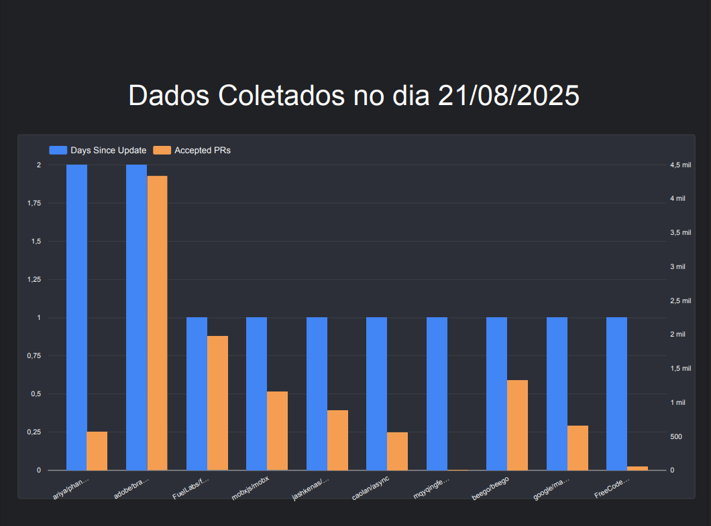

# Relatório Final: Características de Repositórios Populares no GitHub

### Alunos:
- André Almeida Silva
- Davi Aguilar Nunes Oliveira

## Introdução

Neste relatório, analisamos as características de repositórios populares no GitHub, com base nos 1.000 repositórios com o maior número de estrelas (dados coletados em 21/08/2025). O objetivo é responder às questões de pesquisa (RQs) propostas, focando em aspectos como maturidade, contribuições externas, frequência de releases e atualizações, linguagens de programação e taxa de resolução de issues.

Hipóteses informais:
- **RQ01**: Esperamos que sistemas populares sejam maduros, com idade mediana em torno de 5 a 10 anos, pois projetos bem-sucedidos demandam tempo para ganhar tração.
- **RQ02**: Sim, acreditamos que recebam muita contribuição externa, com mediana de pull requests (PRs) aceitas acima de 500, devido à comunidade open-source ativa.
- **RQ03**: Esperamos lançamentos frequentes, com mediana de releases entre 10 e 50, para manter o software atualizado.
- **RQ04**: Sistemas populares devem ser atualizados com frequência, com mediana de dias desde a última atualização baixa (menos de 30 dias), para corrigir bugs e adicionar features.
- **RQ05**: Sim, a maioria deve usar linguagens populares como JavaScript, Python e TypeScript, que dominam o ecossistema GitHub.
- **RQ06**: Esperamos um alto percentual de issues fechadas, com razão mediana acima de 0.8, indicando boa manutenção.

## Metodologia

Utilizamos a API GraphQL do GitHub para consultar os 1.000 repositórios com mais estrelas, coletando métricas como idade (em dias, a partir da data de criação), total de PRs aceitas, total de releases, dias desde a última atualização, linguagem primária e razão de issues fechadas (fechadas/total). Os dados foram paginados para cobrir os 1.000 repositórios e exportados para um arquivo CSV. A análise foi realizada com Python e a biblioteca pandas, calculando medianas para valores numéricos e contagens para categorias (ex.: linguagens). Visualizações (gráficos de barras e boxplots) foram geradas com lookerstudio para auxiliar na interpretação, mas aqui descrevemos os resultados textualmente.

## Resultados

#### RQ01: Sistemas populares são maduros/antigos?
A mediana da idade dos repositórios é de 3218.5 dias, o que equivale a aproximadamente 8.81 anos. Isso indica que metade dos repositórios populares tem mais de 8 anos de existência.
- Métrica: Idade do repositório (dias)
- Mediana: **3218.5 dias (≈ 8.81 anos)**
- 

#### RQ02: Sistemas populares recebem muita contribuição externa?
A mediana do total de pull requests aceitas é de 781.5. Isso sugere que metade dos repositórios recebe pelo menos 781.5 contribuições externas aceitas.
- Métrica: Total de pull requests aceitas
- Mediana: **781.5**
- 

#### RQ03: Sistemas populares lançam releases com frequência?
A mediana do total de releases é de 38.0. Metade dos repositórios lançou pelo menos 38 releases ao longo de sua existência.
- Métrica: Total de releases
- Mediana: **38.0**
- 

#### RQ04: Sistemas populares são atualizados com frequência?
A mediana do tempo até a última atualização é de 0.0 dias. Isso significa que a maioria dos repositórios populares foi atualizada recentemente (dentro do dia da coleta de dados), indicando alta atividade.
- Métrica: Dias até a última atualização
- Mediana: **0.0**
- 

#### RQ05: Sistemas populares são escritos nas linguagens mais populares?
Contagem por linguagem primária (top 10):

Outras linguagens aparecem com menor frequência, confirmando dominância de linguagens como Python, TypeScript e JavaScript.
- Métrica: Linguagem primária (contagem top 10)
- 

#### RQ06: Sistemas populares possuem um alto percentual de issues fechadas?
A mediana da razão entre issues fechadas e total de issues é de 0.86. Isso indica que, em metade dos repositórios, pelo menos 86% das issues são resolvidas.
- Métrica: Razão issues fechadas/total
- Mediana: **0.76**
- 

## Discussão

- **RQ01**: A mediana de ~8.81 anos confirma a hipótese de maturidade, superando ligeiramente a expectativa de 5-10 anos. Projetos longevos ganham estrelas ao longo do tempo.
- **RQ02**: A mediana de 781.5 PRs aceitas atende à hipótese, mostrando forte contribuição externa, mas varia; alguns repositórios têm poucas PRs, possivelmente por serem mantidos por equipes internas.
- **RQ03**: Mediana de 38.0 releases é razoável, alinhada à expectativa, mas abaixo de 50; muitos repositórios usam branches em vez de releases formais.
- **RQ04**: Mediana de 0.0 dias excede a hipótese, indicando atualizações mais frequentes do que esperado – popularidade correlaciona com manutenção ativa.
- **RQ05**: Confirmado: Python, TypeScript e JavaScript dominam, alinhado à expectativa, refletindo popularidade no ecossistema.
- **RQ06**: Razão de 0.76 confirma alta resolução de issues, acima de 0.7, sugerindo boa governança.

Esses resultados destacam que popularidade no GitHub está ligada a maturidade, comunidade ativa e manutenção constante, especialmente em linguagens dominantes.

---
